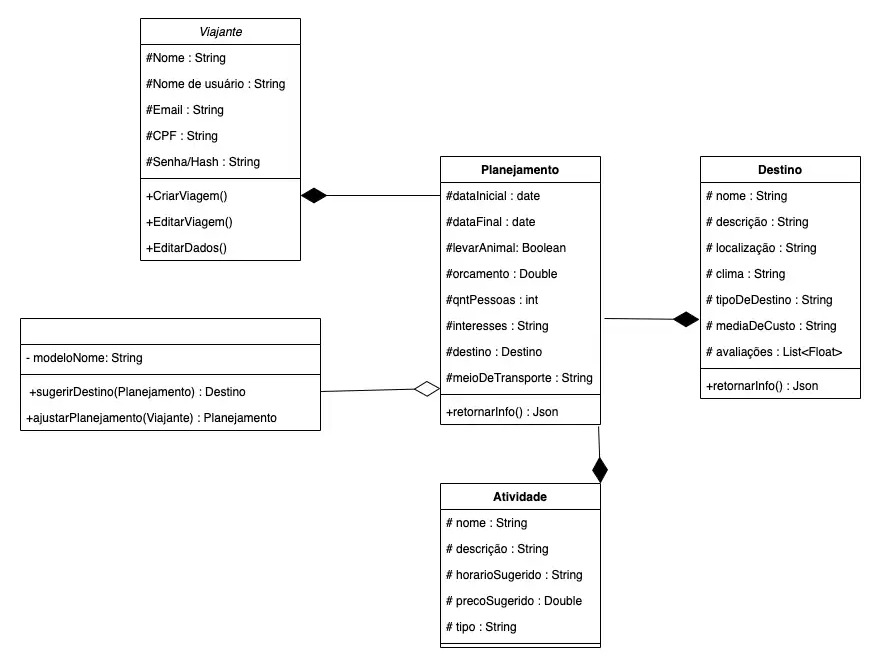

# Flya - 3A2

### ✅ Requisitos Funcionais

#### 🔺 Alta prioridade
- [✅] **RF01** O sistema deve permitir que o usuário insira seu orçamento.
- [✅] **RF02** O aplicativo deve sugerir destinos compatíveis com o orçamento.
- [✅] **RF03** O sistema deve planejar automaticamente hospedagem, transporte e atividades.
- [ ] **RF04** Integração com APIs (Skyscanner, Booking, GetYourGuide).
- [✅] **RF06** Sistema de favoritos para organizar e priorizar viagens salvas.
- [✅] **RF07** Visualização do itinerário detalhado da viagem.
- [✅] **RF09** Sugestões com IA (clima, orçamento, avaliações).
- [✅] **RF11** Resumo de custos detalhado.
- [✅] **RF15** Sistema de busca para destinos e atividades.

#### 🟡 Média prioridade
- [✅] **RF05** Personalização de preferências de viagem.
- [✅] **RF08** Salvar e editar planejamento.
- [✅] **RF13** Sistema de checklist de preparação para viagem.
- [ ] **RF14** Avaliações e feedbacks de usuários.
- [ ] **RF17** Visualizar avaliações de viajantes.
- [ ] **RF19** Pagamentos via carteiras digitais e cartões.

#### 🔻 Baixa prioridade
- [ ] **RF10** Login com autenticação de dois fatores.
- [✅] **RF12** Exportar planejamento em PDF.
- [ ] **RF16** Compartilhamento em redes sociais.
- [✅] **RF18** Interface responsiva que funcione perfeitamente em desktop, tablet e mobile.
- [ ] **RF20** Dashboard com métricas de uso.

Bernardo Orsi do Amaral - 22301127  
Cairo Rodrigues - 22300643  
Eduarda Brandão - 22301755  
Gustavo Albuquerque - 22302093  
Izabela Ferreira - 22300376  
Lucas Diniz - 22301526  

Sua parceira para viagem da sua vida.